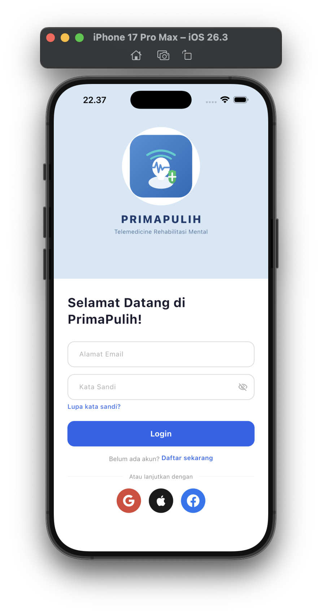
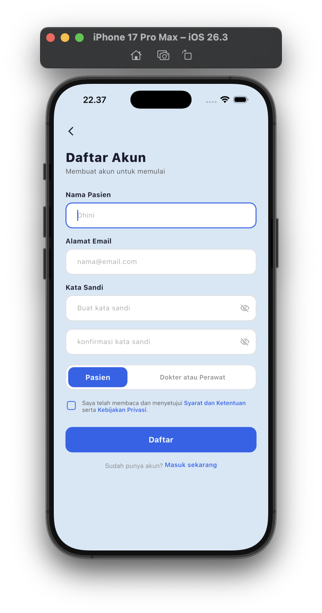
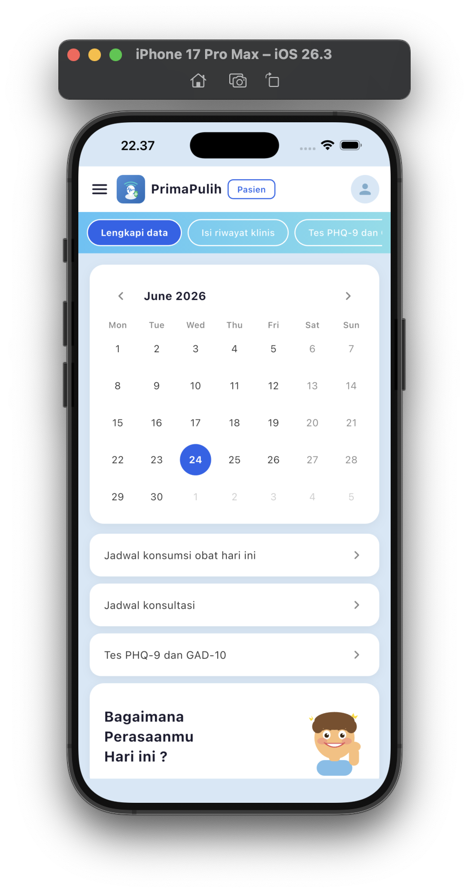
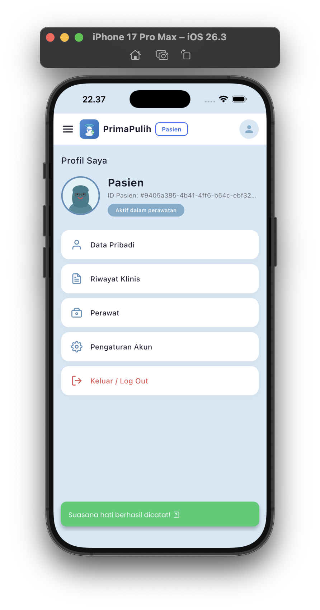
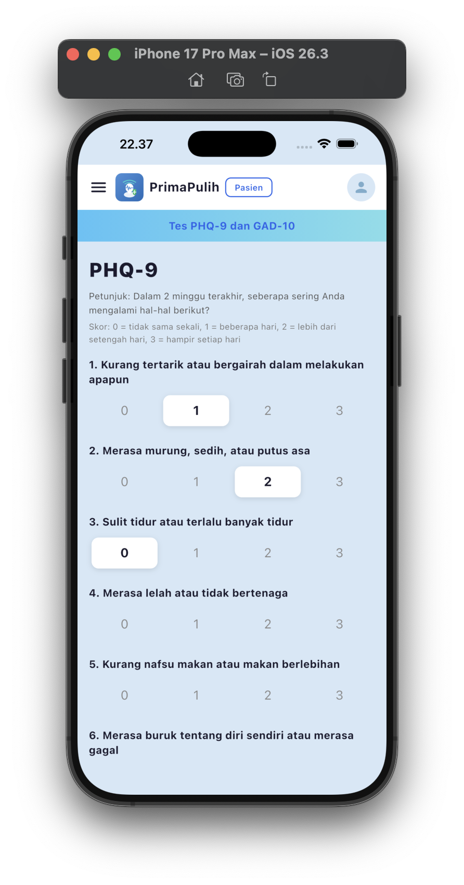
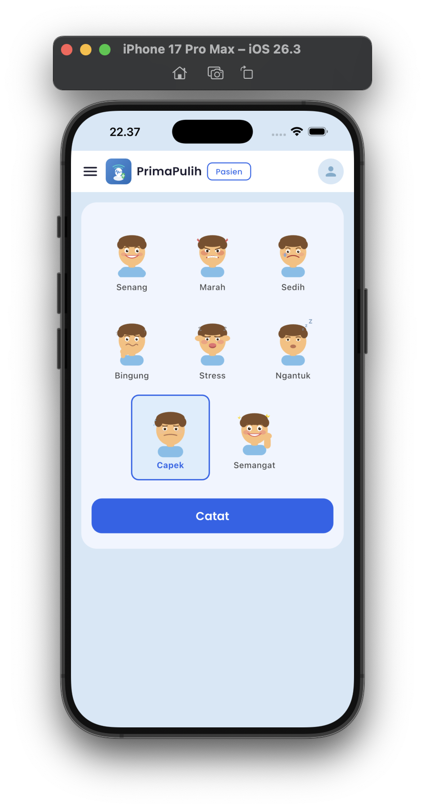
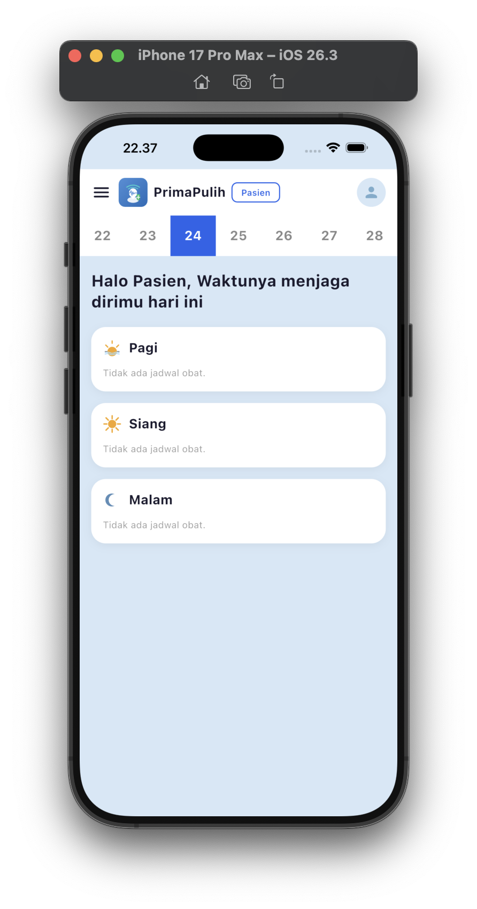
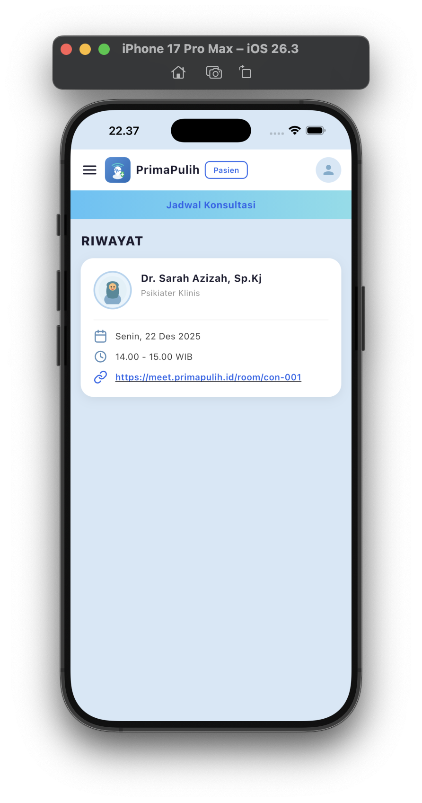

# PrimaPulih

**Telemedicine Rehabilitasi Mental Pasca-ICU**

## Deskripsi Singkat Aplikasi
PrimaPulih adalah platform telemedicine terpadu yang dirancang secara khusus untuk mendampingi pasien penyintas perawatan intensif (ICU) pada masa pemulihan mereka di rumah. Aplikasi ini memfasilitasi komunikasi asinkron antara pasien dan tenaga kesehatan dengan berfokus pada evaluasi kesehatan mental (skrining PICS) serta pemantauan rutinitas medis secara praktis dan mudah digunakan.

## Tujuan Pengembangan Aplikasi
Tujuan utama aplikasi ini adalah untuk mendeteksi secara dini *Post-Intensive Care Syndrome* (PICS), mengurangi risiko gangguan mental pasca-trauma, serta menjembatani pasien dengan tenaga kesehatan tanpa harus bertatap muka setiap saat. PrimaPulih bertujuan memotivasi pasien dalam memantau kesehatan mental harian dan kedisiplinan minum obat mereka.

## Daftar Fitur yang Tersedia
* **Autentikasi & Role Management**: Sistem login/register dengan pemisahan peran yang aman antara "Pasien" dan "Tenaga Kesehatan".
* **Kuesioner Skrining Psikologis (P0)**: Instrumen asesmen terstandar untuk depresi (PHQ-9) dan kecemasan (GAD-7) yang hasilnya terhitung otomatis.
* **Dashboard Tenaga Kesehatan (P0)**: Pemantauan daftar pasien, riwayat skor asesmen, dan deteksi dini kondisi krisis mental oleh perawat/dokter.
* **Mood Tracker Harian (P1)**: Pasien dapat mencatat dan melihat riwayat perubahan emosi (*mood*) setiap hari.
* **Jadwal Kepatuhan Obat (P1)**: Fitur *checklist* harian untuk mencatat tingkat kedisiplinan pasien dalam meminum obat (Pagi, Siang, Malam).
* **Data Pribadi & Profil**: Layar informasi dan status aktif keanggotaan pengguna.

## Teknologi, Framework, Library, dan Komponen yang Digunakan
* **Frontend**: Flutter (Mobile App - iOS/Android)
  * State Management: `provider`
  * Networking: `http`
  * Storage: `flutter_secure_storage`
  * Navigation: `go_router`
  * Assets: `flutter_svg`
* **Backend**: Golang (Go)
  * Framework: `gofiber/v2`
  * Database Driver: `pgx/v5`
  * Security: `bcrypt`, JWT
* **Database**: PostgreSQL 15
* **Infrastruktur**: Docker, Docker Compose

## Struktur Database
Skema database relasional (PostgreSQL) proyek ini berpusat pada relasi tabel utama pengguna:
1. **users**: Autentikasi dan *Role*.
2. **patients** & **health_workers**: Profil entitas masing-masing pengguna (mewarisi ID dari `users`).
3. **assessments**: Penyimpanan riwayat skor skrining (PHQ-9, GAD-7) yang terhubung ke `patients`.
4. **daily_logs**: Jurnal emosi/mood harian pasien.
5. **medications** & **medication_logs**: Master resep obat dari tenaga kesehatan dan riwayat log (*checkbox*) harian pasien.

## Panduan Instalasi dan Menjalankan Aplikasi

### Menjalankan Backend & Database (Docker)
Pastikan Anda sudah menginstal **Docker** dan **Docker Compose**.
1. Buka terminal di *root* folder proyek.
2. Jalankan perintah berikut untuk menginisiasi server dan database:
   ```bash
   docker-compose up --build -d
   ```
3. Backend akan menyala pada port `8080` dan PostgreSQL pada `5435`. Skema database akan terinjeksi secara otomatis saat *container* pertama kali dibangun.

### Menjalankan Frontend (Flutter)
1. Buka tab terminal baru dan arahkan ke dalam folder frontend:
   ```bash
   cd mobile_flutter
   ```
2. Pastikan paket flutter terunduh:
   ```bash
   flutter pub get
   ```
3. Jalankan aplikasi di perangkat yang diinginkan (Emulator/Simulator/Desktop):
   ```bash
   flutter run
   ```

---

## Screenshot Tampilan Aplikasi

| Tampilan Login | Tampilan Register |
| :---: | :---: |
|  |  |

| Dashboard Nakes | Profil Pasien (Biodata) |
| :---: | :---: |
|  |  |

| Kuesioner (Asesmen) | Mood Tracker Harian |
| :---: | :---: |
|  |  |

| Jadwal Konsumsi Obat | Tampilan Meeting / Konsultasi |
| :---: | :---: |
|  |  |
